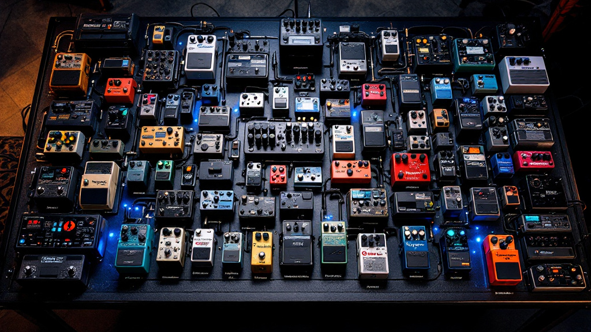
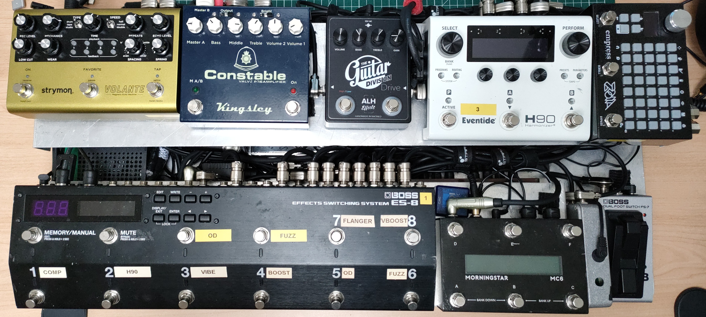
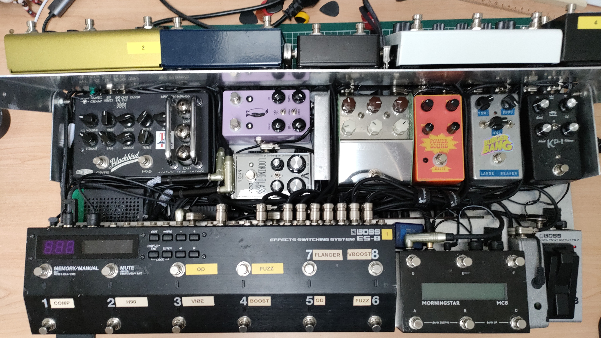
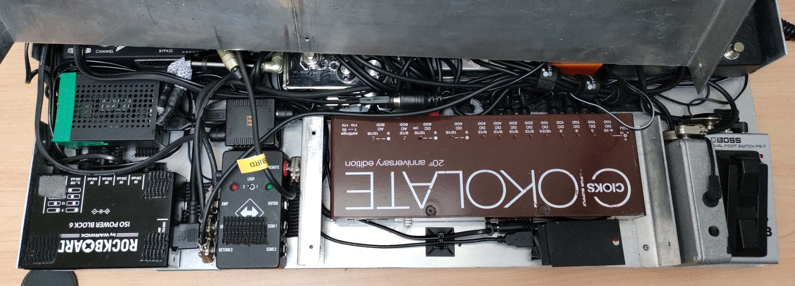
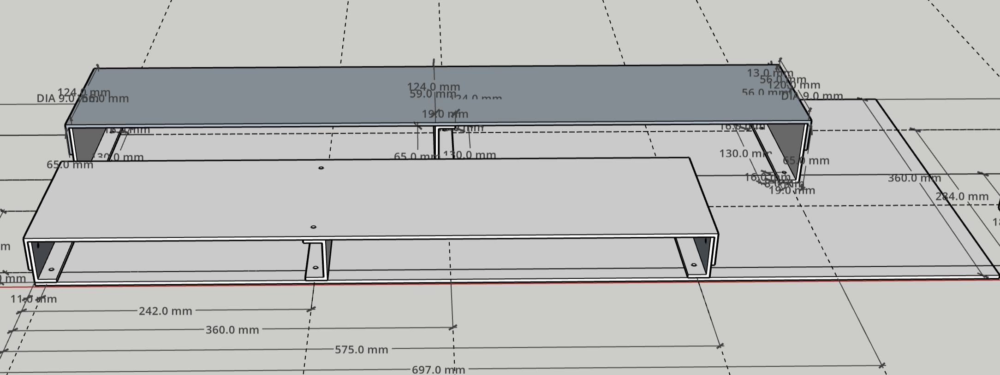
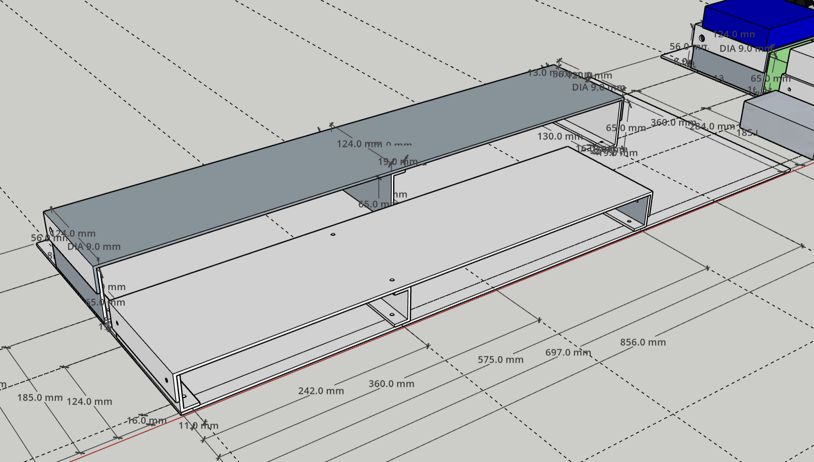
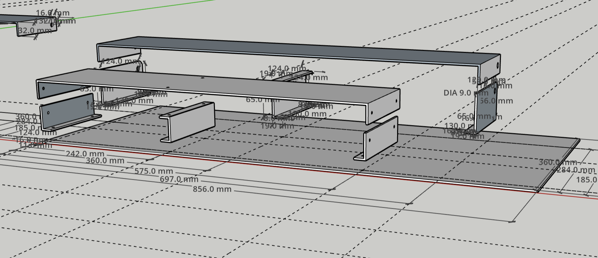
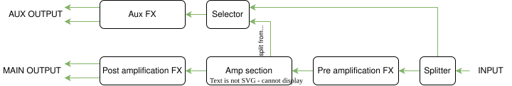
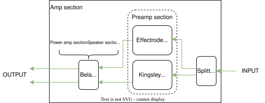
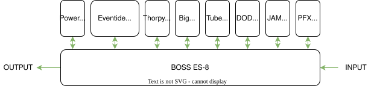

### Introduction

Je me dois de commencer cet article par un avertissement. Nous allons aborder ici de vrais sujets de de gens bizarres : des sujets de guitaristes. Depuis mes toutes premières années de guitariste, autour de 2006-2007, je me souviens être attiré par ces petits objets qu'on appelle pédales. Si vous n'êtes pas familier du monde des guitaristes, une pédale est un effet audio intégrer dans un boitier actionnable à travers une pédale, d'où le nom. Ces petits objets permettent donc d'enrichir la palette sonore du musicien avec de multiples effets : saturation, chorus, flanger, phaser, délai, tremolo, reverb, etc. Pour couronner le tout, ces pédales peuvent être combinées et recombinées à l'infinie. On trouve alors un terrain de jeu illimité, tout à fait comparable au monde du synthétiseur modulaire.

Cela fait longtemps que je souhaite partager les détails de la conception de mon pedalboard de guitare. Il s'agit, je crois, d'un assemblage assez unique, qui marie une approche classique du son, très inspirée des années 70 et 80 – pensez amplis à lampes, cumul des étages de gain, saturation analogique – avec une dimension résolument moderne. Malgré sa taille et ses possibilités étendues, il reste relativement compact. Surtout, il intègre des outils numériques de pointe, qu'il s'agisse d'effets du commerce, comme ceux d'Eventide, ou de créations sur mesure que j'ai développées spécifiquement. Ce pedalboard me permet ainsi d'obtenir des sons "vintage" authentiques tout en ouvrant la porte à des explorations sonores contemporaines.

:::{layout-ncol="2"}

:::

L'idée maîtresse derrière ce projet est de combiner le meilleur des deux mondes : la chaleur, la dynamique et la sensation de jeu de l'analogique et la flexibilité, la puissance et les possibilités créatives du numérique. L'objectif était de parvenir à un système complet, capable de remplacer un amplificateur traditionnel si besoin, tout en offrant une palette sonore extrêmement large. Je voulais pouvoir passer d'un crunch léger à des textures ambiantes complexes, le tout dans un format transportable et ergonomique.

### Les influences

Gamin, j'ai pu passer des heures à chercher le matériel utiliser par mes héros. C'est une obsession assez bizare mais qui peut parfois se révéler assez productive si on arrive à l'aborder avec un peu de distance. Je m'explique.

Simplement chercher à retrouver exactement le même matériel est bien souvent impraticable et trop cher. Parcontre, derrière tout ces arrangements d'amplis, de guitares et de pédales, il y a une certaine logique qui peut être bonne à étudier et à répliquer.

:::{layout-ncol="4"}

:::

Ma plus grande influence guitaristique est celle de David Gilmour. Si, aujourd'hui, j'apprécie l'ensemble de sa carrière avec des éléments d'intérés différent, mon premier point d'accroche reste indubitablement le double album live PULSE. Fût un temps où j'avais relevé chaques solos des différentes versions publics (et oui, le CD et le DVD n'ont pas les même interprétation !). J'ai également collectionné un certain nombre de bootleg de la tournée mondiale de 1994 des Pink Floyd.

D'un point de vue "stratégie sonore", j'ai lui ai emprunté beaucoup de choses :

+ Le boost des mediums SPC de EMG, qui équipe toutes mes guitares
+ Les micros "noiseless"
+ Un ampli assez clean, prêt pour acceuillir un certain nombre de pédales de drive différente
+ Le son des haut-parleur rotatif.

On verra un peu plus loin qu'au moins trois des pédales présentes sur mon pedalboard sont des références quasiment direct à Gilmour.

:::{layout-ncol="3"}

:::

Bien que déclinante depuis ces dernières années, Steven Wilson a laissé une marque importante sur mon rapport à l'instrument. Peut être plus sur des idées de jeu que sur les sonorités à proprement parlé, mais Porcupine Tree à tout de même été une de mes portes d'entré vers le metal. Je lui ai donc piqué :

+ Son système de vibrato. Si si, c'est grâce à ses PRS que j'ai eu l'idée d'installé un chevalet MannMade sur ma Stratocaster.
+ Des effets plus "modernes" (moderne des années 90) : pitch shifter, vibrato, etc.
+ Les rythmiques clairement inspiré de l'univers metal.

:::{layout-ncol="3"}

:::

Une dernière influence, plus récente, mais qui devient de plus en plus importante est Robert Fripp. Tant pour son travail avec King Crimson (particulièrement le quatuor des années quatre-vingt), que solo, avec Brian Eno, Andy Summers, Peter Gabriel, David Bowier, etc. J'en retiens directement :

+ La synthèse sonore à partir du son de la guitare
+ Le travail autour des textures ambiant (Frippertronic)
+ Le sustainer (Ebow dans mon cas)
+ Le rapport experimental à l'instrument

### Conception Matériel

:::{layout-ncol="3"}

:::

Avant de plonger dans le chemin du signal, un mot sur la structure physique qui accueille tous ces éléments. Après avoir réalisé les plans, mon père s'est chargé de la fabrication. Il en résulte une structure en aluminium sur mesure, organisée astucieusement sur trois niveaux pour optimiser l'espace et l'ergonomie. Un niveau inférieur, "au sol", loge une partie des pédales et les alimentations. Au-dessus, un premier étage surélevé à l'avant accueille les contrôleurs principaux – switchers et contrôleurs MIDI – pour un accès facile au pied. Enfin, un deuxième étage, situé derrière les contrôleurs, héberge une autre rangée de pédales d'effets. Cette conception permet de gérer le nombre conséquent d'éléments de manière ordonnée.

### Le Chemin du Signal

Pour appréhender son fonctionnement global, le parcours du signal peut être vu comme une architecture en trois étapes majeures qui interagissent. Nous avons d'abord les **effets pré-amplificateur**, majoritairement analogiques, qui façonnent le son brut de la guitare. Ensuite vient le cœur du système, la **simulation d'amplificateur**, une solution hybride qui comprend les étages de préamplification, de puissance et le haut-parleur d'un ampli traditionnel. Enfin, une chaîne parallèle dédiée aux **effets et au sound design** offre une sortie auxiliaire pour la création sonore plus expérimentale, les textures et le looping.

#### Simulation d'Amplificateur Principale

Une des particularités majeures de ce pedalboard réside dans son intégration d'une simulation complète d'amplificateur, le rendant autonome. Il faut se rappeler qu'un ampli guitare traditionnel ne fait pas qu'amplifier ; il colore, sature et filtre le son à travers ses différents étages (préampli, ampli de puissance, haut-parleur). Reproduire ces caractéristiques complexes est essentiel pour un son authentique.

:::{layout-ncol="2"}

{width="50%"}

:::

En premier lieu, plutôt qu'un seul préampli, j'en utilise deux fonctionnant en parallèle. D'un côté, le canal clair de l'**Effectrode Blackbird**, inspiré des sons clairs Fender, très dynamique ; de l'autre, une **Kingsley Constable**, inspirée des Marshall Plexi, plus crunchy et compressée. Chacun est connecté à une entrée distincte d'une carte audio. Le mélange de ces deux caractères offre une richesse harmonique intéressant et une bonne dynamique.

Un défi inhérent à cette approche parallèle est la gestion de la phase entre les deux signaux. À la mesure, on observe une inversion de phase globale, simple à corriger numériquement. Cependant, un déphasage résiduel dans le bas du spectre subsiste, qui impose une correction plus fine employant des filtres passe-tout.

:::{layout="[30, 70]"}

Cette correction de phase, ainsi que la simulation des étages suivants de l'amplification sont confiées à un cerveau numérique dédié. Il s'agit d'un mini-ordinateur **BeagleBone Black**, similaire à un Raspberry Pi, équipé d'une interface audio très basse latence **Bela**, le tout tournant sous un système Linux temps réel. Sur cette plateforme, plusieurs processus logiciels sur mesure opèrent : la correction de phase pour aligner les préamplis, la **simulation d'ampli de puissance** réalisée via un réseau de neurones (utilisant la librairie RT Neural) entraîné sur mon propre ampli Laney Lionheart, et la **simulation de haut-parleur**, actuellement effectuée par convolution d'une réponse impulsionnelle (IR).

:::

J'y ai également ajouté une **simulation de haut-parleur rotatif**, écrite par mes soins en langage FAUST. (Pour les curieux, un article détaillé sur le développement de ce module "Bela.PAM" est disponible [lien à insérer ici si disponible]).

:::{layout="[70, 30]"}

Après ce traitement numérique complet simulant l'ampli, le signal principal traverse un dernier effet : une **Strymon Volante**. C'est une excellente simulation d'écho multitêtes, très polyvalente, capable de fournir des délais classiques, saturés, ou même des textures proches de la réverbération. Vous remarquerez d'ailleurs l'absence de réverbération dédiée sur cette sortie principale. C'est un choix délibéré : je préfère laisser la gestion de la réverbération globale à l'ingénieur du son, car elle dépend fortement du lieu du concert et du contexte du mix.

:::

#### Les Effets Pré-amplificateur

Revenons au début de la chaîne. Cette première section, qui précède la simulation d'ampli, est volontairement constituée majoritairement d'effets analogiques, surtout pour les saturations. Ce choix est motivé par plusieurs raisons. D'abord, la **qualité sonore** : je cherche à éviter les artefacts numériques comme l'aliasing, qui peuvent apparaître avec les fortes saturations. Ensuite, la **sensation de jeu** : je n'ai personnellement jamais retrouvé en numérique l'équivalent de la réactivité et de la dynamique des pédales de saturation analogiques. Enfin, la **latence** : chaque système numérique ajoute un faible retard, qui, cumulé sur plusieurs pédales, peut devenir perceptibles (au-delà de 5-10 ms). Cela peut être gênant pour le confort de jeu, surtout en live où s'ajoute la latence inhérente au système de diffusion (console de mixage, réseau informatique pour le transport des signaux audio, processeurs de diffusion, etc.). Viser moins de 5 ms de latence totale pour le pedalboard me semble être une bonne cible.

:::{layout-ncol="4"}

:::

Le signal de la guitare rencontre donc d'abord un compresseur **PFX KP1**, utile pour homogénéiser la dynamique en son clair. Il traverse ensuite le premier bloc d'effets d'une **Eventide H90**, utilisé ici principalement pour les traitements placés en tout début de chaîne comme le pitch shifting, la whammy, la wah, divers filtres, le freeze, ou des effets ponctuels comme le trémolo. Suit une création personnelle, **"Wobbles"**, une sorte d'hybride entre phaser et vibrato, actuellement implémenté en numérique (codé par mes soins), mais que j'espère un jour pouvoir réaliser en analogique.

On entre alors dans les étages de gain successifs. Le premier est un overdrive très léger, la **DigiTech / DOD Looking Glass**, qui simule la saturation naturelle d'un ampli poussé légèrement, de manière assez transparente et sans trop compresser. Vient ensuite l'overdrive principal, une **ALH Division Drive**, pédale à lampe d'une marque française (ALH Effects), inspirée de la BK Butler Tube Driver chère à l'un de mes guitaristes de référence, offrant deux niveaux de gain commutables. Pour les sons encore plus saturés, j'utilise un clone d'une **Big Muff Ram's Head** que j'ai assemblé (kit BYOC) et qui inclu un contrôle des médiums, très utile pour sculpter le son, même si je privilégie souvent la position la plus creusée.

Après les saturations, le signal rencontre une modulation **ThorpyFX CamoFlange**. C'est une excellente alternative à l'Electro-Harmonix Electric Mistress, offrant ce son de flanger un peu "chorusy" caractéristique, mais avec un meilleur rapport signal/bruit et sans la perte de volume parfois associée à l'originale.

Enfin, le dernier maillon de cette chaîne analogique est un **clone de Power Boost** (autre kit DIY et autre référence à mon guitariste fétiche), qui remplace mon ancienne Boss GE-7. Il fournit un boost de volume significatif avec une accentuation marquée des médiums, idéal pour percer dans le mix lors des solos.

#### Effets, Sound Design et Sortie Auxiliaire : L'Atelier Sonore

Parallèlement à cette chaîne principale que nous venons de décrire, une seconde voie s'ouvre, dédiée à des applications plus créatives et à l'expérimentation sonore. Un commutateur (JHS Switchback) permet d'alimenter cette chaîne auxiliaire de deux manières : soit avec le signal brut de la guitare, prélevé *avant* toute la chaîne de traitement analogique, soit avec le signal sortant du préampli **Effectrode Blackbird** (via sa sortie "Direct Out"). Ce signal non affecté ("dry") est souvent indispensable pour certaines techniques, notamment la synthèse sonore à partir du son de la guitare.

Lorsque le signal clair de la Blackbird est sélectionné, il transite d'abord par une autre simulation d'ampli maison, plus simple, que j'appelle la **"mini.PAM"**. Celle-ci est développée sur une carte **Daisy Seed** (Electrosmith) et utilise des algorithmes DSP classiques pour simuler l'ampli de puissance  (Waveshapers), une simulation de HP simplifiée (filtres IIR/FIR) incluant les non-linéarités du haut-parleur, et un étage de décorrélation pour créer des effets de doublage lorsqu'associée avec la sortie principale du pedalboard.

:::{layout-ncol="2"}

{width="50%"}

{width="50%"}

:::

Le signal issu du commutateur (et potentiellement traité par la mini.PAM) atteint ensuite les effets de cette chaîne auxiliaire : le **second bloc d'effets de l'Eventide H90** et, surtout, une **Empress ZOIA**. Cette dernière est un outil extrêmement puissant, sorte de synthétiseur modulaire au format pédale, permettant de créer des effets très complexes.

Cette chaîne parallèle devient alors un véritable atelier sonore. Elle me permet de générer des sons de synthétiseur pilotés par la guitare (d'où l'intérêt du signal clair), de créer des nappes ambiantes denses grâce à la synthèse granulaire ou de longs délais/reverbs via la H90 et la Zoya, de fonctionner comme un looper avancé, ou simplement de doubler le son principal avec des effets très différents. C'est une véritable extension créative aux sons de guitare plus classiques.

### Contrôle et Ergonomie

Piloter cet ensemble complexe requiert évidemment un système de contrôle bien pensé pour rester gérable en situation de jeu. Le chef d'orchestre principal est un switcher **BOSS ES-8**. Il gère la commutation et les combinaisons des 8 pédales de la section pré-amplificateur analogique, permettant de créer des presets rappelant différentes configurations. Il envoie également des messages MIDI pour changer les presets des appareils numériques compatibles (bela.PAM, Volante, H90, Zoya).

Pour une finesse accrue et un contrôle plus direct, un contrôleur MIDI auxiliaire **Morningstar MC6** vient compléter l'ES-8. Il me permet d'envoyer d'autres messages MIDI pour modifier des paramètres spécifiques sur les pédales MIDI sans changer de preset global (par exemple, ajuster un temps de delay, la vitesse du Leslie simulé, etc.). Je peux aussi l'utiliser pour charger manuellement des patchs spécifiques sur l'Eventide ou l'Empress.

:::{layout=[75,25]}

:::

Pour le live, la MC6 me permet d'ordonner les presets du BOSS ES-8. J'ai donc un bouton "Next" qui me permet d'avancer dans tous les presets du concert. Ce même message "Next" est également envoyé via MIDI à une application iPad de **prompteur** pour afficher les bonnes paroles ou accords au bon moment.

Enfin, pour rendre cette fonction "Next" immédiatement accessible, un simple **footswitch externe** (type BOSS FS) est connecté à la MC6 et dédié uniquement à cette commande. Placé à un endroit pratique, il me permet de changer de son ou de section de morceau très rapidement, sans avoir à quitter ma position ou à réfléchir à quel bouton presser sur les contrôleurs principaux.

### Conclusion

Ce pedalboard est le fruit d'années d'expérimentation et d'une réflexion constante sur la manière de fusionner mes influences classiques avec les possibilités offertes par la technologie actuelle. Il représente un équilibre très personnel entre la chaleur du son analogique, la puissance du numérique, la flexibilité fonctionnelle et le besoin de contrôle ergonomique. Bien que sa conception soit complexe, il offre une palette sonore immense dans un format qui reste relativement intégré et transportable.

J'espère que cette présentation détaillée vous a intéressé. N'hésitez pas à consulter les liens [à insérer] vers les articles ou vidéos dédiés à mes créations maison (Bela.PAM, Mini PAM, Wobbles) si ces sujets techniques vous intriguent. Comme toujours, les exemples sonores [à insérer ou décrire] illustreront mieux que de longs discours les capacités et les nuances de cet assemblage particulier.