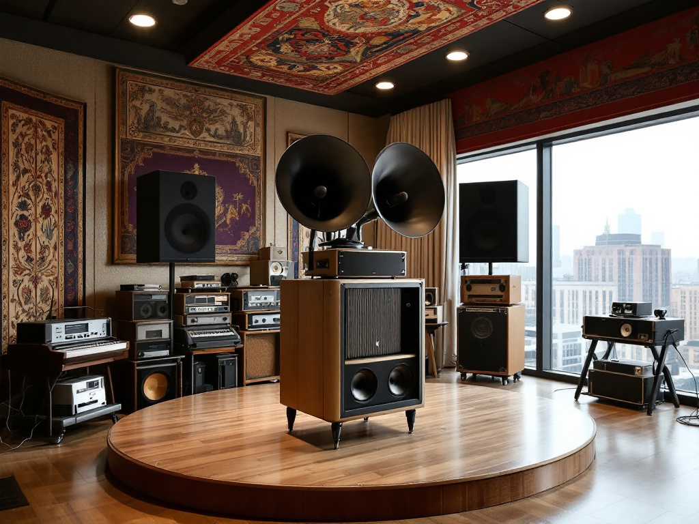
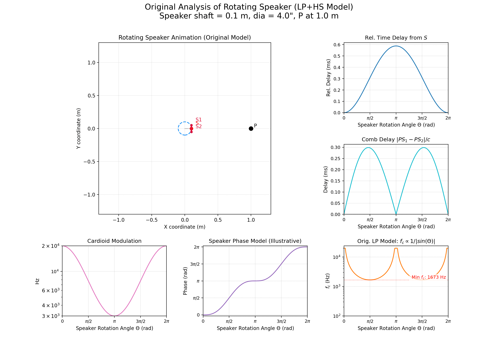
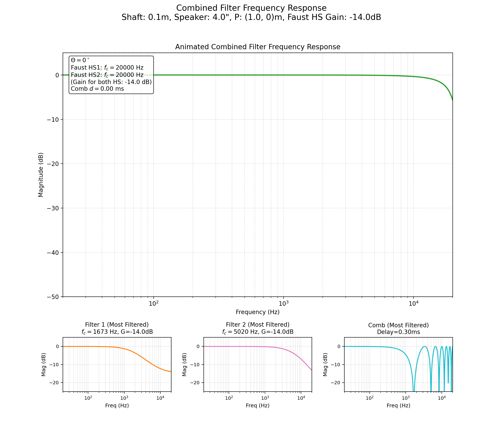
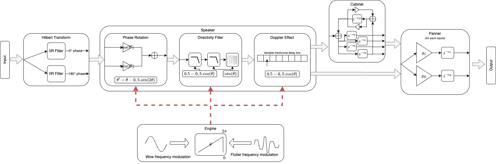

Je suis, depuis très longtemps, fasciné par le son des cabines Leslie et autres machines à haut-parleurs rotatifs. Le principe de ces appareils est de mettre en rotation un pavillon ou une membrane afin de créer un effet de modulation très complexe. Celui-ci est particulièrement associé aux orgues électromécaniques, comme le fameux Hammond B3. Mais depuis les Beatles, rares sont les instruments qui ne sont jamais passés au travers de ces machines. Cet effet unique, mélange de modulation d'amplitude, de fréquence et de phase, ajoute un mouvement et une couleur unique au son.

Étant quelqu'un de (presque) raisonnable, ma fascination ne m'a cependant jamais poussée jusqu'à l'achat d'une telle cabine. Elles sont en effet souvent très chères, très lourdes et possèdent un niveau sonore très important, ce qui les rend, dans mon cas, parfaitement impraticables. Heureusement, nous vivons dans la joyeuse époque du tout numérique : il doit bien alors exister une simulation convaincante de ces appareils ?

Effectivement, le marché des plug-ins ou des pédales d'effet est plutôt bien fourni en ce genre de simulation. Et pourtant, je me suis toujours trouvé insatisfait par celles-ci. D'une part, la plupart simulent des cabines Leslie classiques, là où je suis beaucoup plus intéressé par des machines comme la série Yamaha RA, avec ses multiples tweeters rotatifs, ou les Doppolas qui ont marqué la tournée 1994 des Pink Floyd^[Le Yamaha RA200 est également largement associé à David Gilmour, depuis environ 1974, et est largement représenté sur le live "Is There Anybody Out There?"]. D'autre part, ces simulations produisent souvent une forte altération du timbre, leur objectif étant bien logiquement de remplacer une cabine Leslie et de ne pas simplement reproduire sa modulation caractéristique. Cela se révèle être un problème, car, dans mon cas, je ne cherche que cette modulation, et pas la réponse en fréquence d'une cabine Leslie. Un guitariste joue généralement sur un ampli guitare ou sur un système où l'emprunte acoustique d'un haut-parleur existe déjà, il est donc indésirable d'ajouter une deuxième coloration aussi forte. Enfin, je trouve aussi qu'un certain nombre d'algorithmes ne sont pas très convaincants d'un point de vue sonore. Sans doute cela relève-t-il d'une question de goût, mais cela m'a suffisamment motivé pour investiguer sur le sujet.

Voilà plus d'un an que je tourne autour de cette question, et je crois avoir aujourd'hui suffisamment d'éléments de réponse pour écrire un article relativement complet sur la simulation de ces fameuses cabines à haut-parleurs rotatifs. L'objectif est alors de développer quelques blocs de traitement du signal permettant de modéliser le comportement physique d'un haut-parleur en rotation.

Pour guider ce développement, je me suis fixé un **cahier des charges**.

1.  La modélisation doit être suffisamment réaliste par rapport à la géométrie et à la physique du phénomène étudié.
2.  La perception du niveau sonore et du timbre de la source doit être préservée.
3.  Le modèle s'intéresse à des haut-parleurs et pas à des pavillons.
4.  Le résultat doit être suffisamment économe en ressource pour tourner sur une carte embarquée.

## Historique

L'idée de faire tourner un élément diffusant du son pour créer un effet de modulation a été popularisée par Donald Leslie dans les années 1940 [@FenderVibratone; @UnearthingMysteriesLeslie]. Sa création la plus célèbre, la **cabine Leslie**, était initialement conçue pour ajouter un effet de "chorus" aux orgues Hammond qui, selon Leslie, avait un caractère trop statique. Cette cabine comprend typiquement un pavillon rotatif pour les hautes fréquences et un haut-parleur de graves diffusant dans un tambour rotatif percé d'une ouverture. Souvent, les deux éléments tournent à des vitesses légèrement différentes, parfois même dans des directions opposées, créant une modulation riche et complexe.



De nombreux organistes ont embrassé cette cabine (Jimmy Smith, Keith Emerson, Rick Wakeman, Jon Lord) ainsi que de nombreux guitaristes, tels que George Harisson et Jimi Hendrix.

:::{layout-ncol="2"}



:::

Au-delà de la "Leslie", d'autres constructeurs ont proposé leurs propres versions ou des concepts similaires, parfois plus adaptés à d'autres instruments. La série **Yamaha RA** comme évoqué précédemment, comportait souvent une section de basses fréquences statique et plusieurs haut-parleurs d'aigus montés sur un rotor, avec un entraxe de rotation souvent plus court produisant un effet distinct.



Fender a également commercialisé le **Vibratone** (aussi connu sous le nom de Leslie Model 16 & 18), une version plus compacte avec un seul haut-parleur et un rotor en polystyrène, populaire chez les guitaristes comme Stevie Ray Vaughan [@FenderVibratone]. Des dispositifs comme le **Maestro Rover RO-1** (ou R D.1), un petit rotor avec un haut-parleur de 6 pouces, et sa version plus puissante, le **Doppolas**, développée sur mesure par l'équipe technique de David Gilmour (encore lui) pour la tournée de *The Division Bell* en 1994 (observation de l'auteur, basée sur la transcription).



## Modèle Physique et Géométrique

{#fig-geometry}

Nous allons maintenant présenter le modèle géométrique et physique retenu pour cette simulation de haut-parleur rotatif. Rappelons que l'objectif de ce travail est d'obtenir un effet suffisamment réaliste à l'oreille et économe en ressources pour qu'il devienne un outil musical pertinent.

Posons alors les données suivantes :

*   $P$ est le point d'écoute.
*   Le haut-parleur est représenté par une membrane plane, de longueur (diamètre) $S_1S_2$ et de centre $S$.
*   $O$ est le centre de rotation du haut-parleur. Le rayon du cercle de rotation est donné par la distance $r = OS$.
*   $\theta$ est l'angle $\widehat{POS}$ (angle de rotation instantané du haut-parleur par rapport à une référence).

Si on essaye de décomposer le phénomène sonore produit par un haut-parleur rotatif, on se rend compte qu'il y a trois **constituants principaux** :

1.  L'effet Doppler produit par la variation de distance entre le haut-parleur et le point d'écoute.
2.  L'inversion de phase, selon que la membrane pointe vers l'auditeur ou du côté opposé.
3.  Le filtrage induit par la directivité du haut-parleur.

Chacun de ces phénomènes possède une relation avec l'angle de rotation du haut-parleur et différentes dimensions du modèle (taille de la membrane et/ou longueur de l'axe de rotation).

### Effet Doppler

Il s'agit sans doute de la composante la plus triviale à expliquer. L'effet Doppler est un effet caractéristique impliquant une perception de variation de la hauteur d'un son lorsque sa distance à l'auditeur varie [@DopplerEffect2025].

On considère alors que le signal du haut-parleur est émis au point $S$ et que ce signal est entendu au point $P$. On cherche donc à connaître l'évolution de la distance $PS$ en fonction de l'angle de rotation du haut-parleur $\theta$. Dans un premier temps, on considère que $P$ est placé sur le cercle décrit par la rotation du haut-parleur.

Les coordonnées cartésiennes de $P$ et $S$ sont $P=(r,0)$ et $S=(r \cos\theta, r \sin\theta)$. On peut donc calculer $PS$ tel que $PS = \sqrt{ (x_S - x_P)^2 + (y_S - y_P)^2 }$. Il en découle alors :
$$
PS = 2r |\sin(\theta/2)|
$$
Ce qui nous intéresse alors est de trouver la relation entre $PS$ et le temps de parcours de l'onde acoustique, soit :
$$
t_{parcours} = \frac{PS}{C_{son}} = \frac{2r |\sin(\theta/2)|}{C_{son}}
$$

Où $C_{son}$ est la vitesse du son dans l'air, $C_{son} \approx 340 \text{ m} \cdot \text{s}^{-1}$.
C'est cette variation de temps qui nous permettra de reproduire l'effet de variation de la hauteur du son. Maintenant, si on place $P$ hors du cercle de rotation, on ne fera qu'introduire une distance supplémentaire constante égale à $OP-r$ (si $P$ est plus loin que le cercle), qui, dans notre modèle numérique, ne fera que rajouter une latence indésirable. On se contentera alors de la relation précédente, afin de privilégier une opération avec un minimum de latence.

### Inversion de Phase

Comme un haut-parleur n'est rien d'autre qu'une membrane, lorsque celle-ci, pointant vers l'auditeur, émet une surpression, une dépression est créée à l'arrière de celle-ci [@beranekAcousticsSoundFields2012].

Un modèle très simple consisterait à considérer que la directivité du haut-parleur est purement bipolaire. Dès lors, on pourrait appliquer une modulation d'amplitude suivant un facteur $\cos(\theta)$. Ainsi, lorsque le haut-parleur fait face à l'auditeur, le gain linéaire est positif et quand le haut-parleur émet dans la direction opposée, le gain linéaire est négatif. Le problème de ce modèle est que l'on doit passer par un gain linéaire nul pour l'ensemble des fréquences. Ainsi, à $\pm \frac{\pi}{2}$, nous n'avons plus de son ! Cela ne correspond pas à la perception du phénomène réel.

Nous allons donc concevoir un filtre qui permet de changer arbitrairement la phase d'un signal, sans introduire de variation d'amplitude notable. Cependant, nous ne pouvons pas passer d'un état de phase à un autre de façon abrupte sans risque de créer des artefacts sonores désagréables. Nous allons donc définir une courbe d'évolution de la phase $\Phi$ du signal en fonction de l'angle de rotation $\theta_{rot}$ du haut-parleur. La fonction choisie (choix de conception de l'auteur) est :
$$
\Phi(\theta) = \theta - \frac{\sin(2\theta)}{2}
$$

Cette fonction, utilisée dans la modélisation de la phase, permet de simuler que le haut-parleur reste "en phase" ou "hors phase" plus longtemps, avec des transitions plus rapides sur les côtés.

### Directivité du Haut-Parleur



Pour correctement simuler la variation du timbre introduite par la rotation du haut-parleur, nous allons décomposer celle-ci en plusieurs parties.

Lorsque le haut-parleur tourne, le signal émis est atténué avec une certaine prévalence fréquentielle. Quand l'angle de rotation $\theta$ varie de $0$ à $\frac{\pi}{2}$ radian, on observe une atténuation des fréquences dans le haut du spectre, se rapprochant d'un filtre passe-bas du premier ordre [@SpeakerDirectivityModeler]. Le modèle physique utilisé ici est celui du piston dans un baffle infini [@beranekAcousticsSoundFields2012].

La directivité d'un tel piston devient significative lorsque la différence de marche entre les ondes émises par les bords opposés de la membrane, pour un point d'écoute situé à un angle $\theta$ par rapport à l'axe du piston, devient comparable à une demi-longueur d'onde. Cette différence de marche est donnée par $|S_1S_2| |\sin(\theta)|$. En posant que la directivité est notable lorsque cette différence de marche est égale à $\lambda/2$, on obtient la relation $\lambda/2 = |S_1S_2| |\sin(\theta)|$, soit :
$$
\lambda = 2 |S_1S_2| |\sin(\theta)|
$$

et comme $\lambda = \frac{C_{son}}{f_c}$, où $C_{son}$ est la célérité du son dans l'air, on trouve alors la fonction de la fréquence de coupure suivante, au-delà de laquelle le rayonnement devient de plus en plus directif:
$$
f_c(\theta) = \frac{C_{son}}{2 |S_1S_2| |\sin(\theta)|}
$$

Pour un haut-parleur de 5 pouces, soit $0.127$ mètres, et un angle d'incidence de $\frac{\pi}{2}$, on trouve :
$$
f_c(\pi/2) = \frac{340}{2 \times 0.127 \times \sin(\frac{\pi}{2})} \approx 1.3 \text{ kHz}
$$
Lorsque l'angle d'incidence est nul ($\theta=0$), on trouve que :
$$
\lim_{\theta \to 0} f_c(\theta) = +\infty
$$
Le filtre n'agit pas dans ce cas de figure.

On trouve donc que notre filtre varie de $]+\infty; 1.3] \text{ kHz}$ pour un angle d'incidence variant de $[0; \frac{\pi}{2}]$. Au final, notre fonction liant la fréquence de coupure de notre filtre, la directivité et le diamètre de la membrane est :
$$
f_c(\theta) = \frac{C_{son}}{2 |S_1S_2| \sin(\theta)}
$$
Le problème du modèle "piston dans une enceinte infinie" est qu'il ne définit pas les angles d'incidence compris entre $-\frac{\pi}{2}$ et $\frac{\pi}{2}$ et passant par $\pm\pi$ radian (l'arrière du HP) de manière qui tienne compte de l'obstruction physique. Or, nous avons besoin de pouvoir tourner tout autour du haut-parleur. La solution retenue est d'utiliser $|\sin(\theta)|$ pour une directivité symétrique avant/arrière pour le filtrage principal, et d'ajouter un second filtre pour modéliser l'atténuation supplémentaire des aigus à l'arrière du HP.

Enfin, il faut tenir compte de la taille de la membrane. En effet, plus celle-ci est grande, plus on verra apparaître un phénomène de diffraction de l'onde acoustique, produisant alors un filtre en peigne lorsque le point d'écoute est hors axe de la membrane. La fréquence du premier creux du filtre en peigne est directement fonction de la largeur de la membrane pour un angle d'incidence de $\frac{\pi}{2}$. Pour reproduire ce filtre en peigne, il suffit donc de retarder le signal d'un temps correspondant à la différence de marche $\Delta d$ entre les deux bords de la membrane par rapport au point d'écoute et de le combiner avec le signal non retardé. On exprime alors un retard $\tau$ tel que :

$$
\tau = \frac{\Delta d}{C_{son}}
$$

Où $\Delta d$ est la différence de marche entre les deux extrêmes de la membrane. Les courageux dérouleront le calcul pour trouver qu'à partir du moment où la distance $OP$ est suffisamment grande devant $|S_1S_2|$ on peut alors approximer ce retard par :

$$
\tau(\theta) = \frac{|S_1S_2| |\sin(\theta)|}{C_{son}}
$$

Ainsi, on prend en considération une situation d’écoute réaliste, où l’auditeur se tient à une distance supérieure à au moins dix fois le diamètre de l’enceinte.

## Principes de Traitement Numérique du Signal pour la Simulation

{#fig-signal-path .lightbox}

La concrétisation de ce modèle physique en un effet audio numérique repose sur plusieurs techniques de traitement du signal (DSP). Nous allons décrire ici les principes DSP mis en œuvre pour chaque composante de l'effet.

L'**effet Doppler** est simulé numériquement à l'aide d'une **ligne à retard à longueur variable**. La longueur de cette ligne à retard (exprimée en nombre d'échantillons) est modulée dynamiquement en fonction de la variation de distance calculée $PS(\theta)$ ou de son approximation. Pour éviter les discontinuités audibles (clics) lors de la variation de la longueur du retard, une **interpolation** de Lagrange est employée pour lire les échantillons entre les positions discrètes de la mémoire tampon de la ligne à retard [@smithTimeVaryingDelay2025].

<!-- ADD ANIMATION OF DOPPLER EFFECT FREQUENCY RESPONSE -->

La **rotation de phase** nécessite de pouvoir altérer la phase d'un signal sur une large bande de fréquences sans affecter son amplitude. Une méthode courante pour y parvenir est l'utilisation d'un **signal analytique** [@AnalyticSignal2024]. C'est un signal complexe dont la partie imaginaire est la transformée de Hilbert de la partie réelle (le signal d'origine). En pratique, la transformée de Hilbert est souvent approximée par une paire de réseaux de filtres passe-tout introduisant alors un déphasage de $90^\circ$ sur une large bande [@PhasingMethodHilbert; @wilkinsonIIRHilbertTransformer2017]. Une fois le signal d'entrée $x(t)$ et son signal en quadrature $x_q(t)$ obtenus, un signal déphasé $y(t)$ de $\Phi$ peut être calculé par une combinaison : $y(t) = x(t)\cos(\Phi) - x_q(t)\sin(\Phi)$. L'angle de phase $\Phi$ est lui-même modulé par la fonction $\Phi(\theta_{rot}) = \theta_{rot} - 0.5\sin(2\theta_{rot})$. L'implémentation de la transformée de Hilbert utilisée ici est directement empruntée à l'objet `hilbert~`de PureData.

<!-- ADD ANIMATION OF PHASE ROTATION WITH THE LFO DESCRIBED -->

Le **filtrage induit par la directivité** du haut-parleur est réalisé par une série de **filtres numériques dont les paramètres sont modulés**. L'atténuation des hautes fréquences en fonction de l'angle $\alpha$ est modélisée par des **filtres en plateau (shelving filters)** ou des filtres passe-bas. La fréquence de coupure $f_c$ de ces filtres est dynamiquement ajustée par un oscillateur basse fréquence (LFO) dont la forme d'onde dépend de l'angle $\theta$. L'approximation $f_c(\alpha) = f_{max} (f_{min}/f_{max})^{|\sin\alpha|}$ est utilisée, où $f_{min}$ et $f_{max}$ sont les bornes de la fréquence de coupure. L'avantage de cette formulation est que nous nous épargnons le risque d'une division par zéro, et donc de situation où la fréquence de coupure du filtre tend vers l'infini. 

Le graphique suivant illustre la relation entre l'angle d'orientation du haut-parleur et la fréquence de coupure du filtre de directivité principal, comparant le modèle physique idéalisé avec les approximations utilisées dans la simulation DSP.

```{python}
#| fig-cap: Fréquence de coupure en fonction de l'angle d'incidence.
#| echo: false

import numpy as np
from matplotlib import pyplot as plt
import matplotlib.ticker as mticker

# --- Define constants ---
c_sound = 340  # Speed of sound (m/s)
speaker_width_inch = 4 # Example speaker width in inches
speaker_width = speaker_width_inch * 0.0254  # Speaker width in meters
f_max = 20000  # Maximum frequency (Hz)
# Minimum cutoff frequency when speaker is at 90 degrees (sin(theta)=1)
f_min = c_sound / (2 * speaker_width) # Calculated from diameter

# --- Generate theta values ---
theta_angles = np.linspace(0, 2 * np.pi, 1000)
sin_theta_abs = np.abs(np.sin(theta_angles))

# --- Calculate frequency models ---
# Model 1: Linear interpolation (from your initial draft idea f_1_approx)
f_1_approx_linear_text = f_max - (f_max - f_min) * sin_theta_abs

# Model 2: Logarithmic/Power interpolation (closer to Faust code implementation)
f_1_approx_log_faust = f_max * np.power(f_min / f_max, sin_theta_abs)

# Physical model (clamped at f_max for practicality)
epsilon = 1e-18
f_1_phys_ideal = c_sound / (2 * speaker_width * sin_theta_abs + epsilon)
f_1_phys_clamped = np.minimum(f_1_phys_ideal, f_max)


# --- Create the plot ---
fig, ax = plt.subplots(figsize=(12, 12))

ax.plot(theta_angles, f_1_phys_clamped, label=r'$f_{phys} = \min\left(\frac{c}{2W|\sin\theta|+\epsilon}, f_{max}\right)$', color='blue', linewidth=2.5, zorder=3)
ax.plot(theta_angles, f_1_approx_linear_text, label=r'$f_{approx,linear} = f_{max} - (f_{max}-f_{min})|\sin\theta|$', color='green', linestyle='--', linewidth=1.5, zorder=2)
ax.plot(theta_angles, f_1_approx_log_faust, label=r'$f_{approx,log} = f_{max} \left(\frac{f_{min}}{f_{max}}\right)^{|\sin\theta|}$ (Modèle DSP)', color='red', linestyle=':', linewidth=1.5, zorder=2)

ax.axhline(f_max, color='dimgray', linestyle='-.', linewidth=1, label=f'$f_{{max}} = {f_max:,}$ Hz', alpha=0.9)
ax.axhline(f_min, color='dimgray', linestyle='-.', linewidth=1, label=f'$f_{{min}} = {f_min:,.2f}$ Hz (pour HP {speaker_width_inch}\")', alpha=0.9)

ax.set_yscale('log')

# --- Customize the plot ---
ax.set_xlabel(r"Angle $\theta$ (radians)", fontsize=14)
ax.set_ylabel("Fréquence de coupure (Hz)", fontsize=14)
ax.set_title(f"Comparaison des Modèles de Fréquence de Coupure vs. Angle (HP {speaker_width_inch}\")", fontsize=16, pad=20)

ax.set_xticks(np.array([0, np.pi/2, np.pi, 3*np.pi/2, 2*np.pi]))
ax.set_xticklabels([r'$0$', r'$\pi/2$', r'$\pi$', r'$3\pi/2$', r'$2\pi$'], fontsize=12)

ax.grid(True, which="both", linestyle='--', alpha=0.6)

plot_min_y_val = min(f_min, np.min(f_1_approx_log_faust[f_1_approx_log_faust > 0]))
ax.set_ylim(bottom=plot_min_y_val * 0.8, top=f_max * 1.2)
ax.yaxis.set_major_formatter(mticker.ScalarFormatter())
ax.yaxis.set_minor_formatter(mticker.NullFormatter())

legend = ax.legend(fontsize=10, loc='lower center', bbox_to_anchor=(0.5, -0.35), ncol=2, frameon=True)
plt.tight_layout(rect=[0, 0.22, 1, 0.95])

plt.show()
```

Typiquement, deux de ces filtres sont employés en cascade : un premier avec une modulation reproduisant une directivité bipolaire ($|\sin(\theta)|$) et un second avec une modulation approchant une directivité cardioïde ($0.5-0.5\cos(\theta)$) pour simuler l'effet de l'arrière du haut-parleur.

Ce modèle reflète assez correctement le comportement d'un haut-parleur tournant dans une enceinte. Dans le cas où le haut-parleur est placé dans une enceinte close et que celle-ci est également soumise à la rotation, alors on préfèrera une modulation nous rapprochant alors d'une directivité cardioïde.

La **diffraction** due à la taille de la membrane est simulée par un **filtre en peigne** [@CombFilter2025]. Le retard de ce filtre est modulé par la fonction $\tau(\alpha) = \frac{|S_1S_2| |\sin(\alpha)|}{C_{son}}$, créant des annulations et des additions de fréquences qui varient avec l'orientation du haut-parleur.

La richesse sonore d'un vrai haut-parleur rotatif provient également des réflexions acoustiques générées dans l'enceinte (aussi appelé *cabinet*). Ici, le modèle retenu cherche avant tout à être économe en ressource. Celui-ci se compose de quatre lignes à retard, chacune ayant une valeur de retard correspondant à un nombre premier d’échantillons. Ces quatre retards peuvent être ensuite spatialisés comme souhaité dans l'algorithme final. Ces derniers sont également sommés et renvoyés à l'entrée du circuit de *cabinet* au travers d'un passe-tout de Schoedder.

À ce stade, une étape de **compensation du timbre** est souvent nécessaire. Les filtres de directivité atténuant les hautes fréquences, un **filtre égalisateur statique** (typiquement un filtre en plateau rehaussant les aigus) peut être appliqué en fin de chaîne pour restaurer une balance tonale perçue comme identique au signal avant traitement. Le gain et la fréquence de ce filtre de compensation peuvent être déterminés empiriquement ou en estimant l'atténuation moyenne introduite par les filtres de directivité.

Abordons à présent la modélisation du moteur. Un modèle très satisfaisant consiste à utiliser un **oscillateur basse fréquence** ayant une forme de rampe, parcourant des valeurs allant de $0$ à $2\pi$. On décrit ainsi la révolution complète du haut-parleur.

Cependant, ce modèle très simple peut être significativement amélioré en ajoutant une part d’aléatoire. On cherche donc à faire varier très subtilement la fréquence interne du moteur, reproduisant ainsi les contraintes mécaniques d'un vrai moteur. Pour ce faire, nous appliquons deux types de modulation, que nous appellerons "wow" et "flutter".

+ Le "wow" est caractérisé par une modulation sinusoïdale, très lente, de la fréquence de rotation.
+ Le "flutter" est lui caractérisé pour une modulation aléatoire, très rapidement, de la fréquence de rotation.

L'intensité du "wow" et du "flutter" sont respectivement fixés à $1 %$ et $0.5%$ de la fréquence de rotation du moteur. Les fréquences de modulation du "wow" et du "flutter" sont, toujours respectivement, de $0.5 Hz$ et de $20 Hz$. La fréquence de modulation du "wow" est rendue aléatoire pour chaque haut-parleur rotatif présent dans l'algorithme, la plage des valeurs possibles variant entre $0.4 Hz$ et $0.6 Hz$. Le "flutter" étant une modulation aléatoire, la germe de la séquence de nombre pseudo-aléatoire est différente pour chaque haut-parleur rotatif présent dans l'algorithme. Il en résulte donc une décorrélation supplémentaire entre chaque haut-parleur.

Ces deux modulations peuvent paraître subtiles, mais m'ont paru suffisamment convaincantes pour les conserver dans la version finale de l'algorithme.

Une autre caractéristique de ces moteurs est leur inertie, se caractérisant par un temps de transition plus ou moins long entre deux vitesses de rotation. Pour reproduire cette caractéristique, on applique un filtre de moyennage (un filtre passe-bas du premier ordre) sur le signal de commande correspondant à la fréquence de rotation. On rappelle que la constante de temps $\tau_{inertie}$ d'un tel filtre est lié à sa fréquence de coupure $f_c$ par :
$$
\tau_{inertie} = \frac{1}{2\pi f_c}
$$

Donc, si on souhaite une inertie d'une seconde, on obtient une fréquence de coupure valant $\frac{1}{2\pi} \approx 0.16 \text{ Hz}$.

Il est généralement possible de stopper la rotation des moteurs entrainant les haut-parleurs supprimant du même coup l'effet associé. Cependant la problématique rencontrée est souvent d'imposer une position angulaire du haut-parleur pertinente lorsque le moteur se coupe définitivement. Idéalement on souhaiterait qu'en position "stop" il n'y ai pas d'altération du timbre.

La solution retenue est de simplement basculer la fréquence de rotation du moteur à 0 Hz et de réaliser du même coup un fondu entre la simulation de haut-parleur rotatif et le signal d'entrée. Par inertie, le moteur donne l’impression de s’arrêter. Une transition sonore douce, à priori fonction du temps d’inertie, vers le signal d’entrée garantit la transparence du traitement lorsque le moteur est coupé.

Enfin, la spatialisation des différents haut-parleurs et réflexions est assurée par un algorithme mêlant différence de temps et différence d'intensité. La variation d'intensité est analogue à la loi de panoramique d’un simple panner stéréophonique. On ajoute ainsi une décorrélation supplémentaire grâce à l'utilisation de ligne à retard. Notons que l'ensemble du modèle se comporte plutôt bien lorsqu'il est réduit en mono.

## Exemples Sonores et Modèles Implémentés

À partir de ces blocs fonctionnels, deux modèles principaux ont été implémentés en [FAUST](https://faust.grame.fr/).

Le premier modèle, **`japan_whirl`**, est inspiré par le Yamaha RA-200. Il met en œuvre trois haut-parleurs de 4 pouces, avec un axe de rotation très court de 3 cm et une directivité bipolaire. Le crossover est ici réglé à 900 Hz, et l'inertie est toujours de 2 secondes. Une simulation de cabinet avec une réinjection est utilisée pour ce modèle.

Le second modèle, appelé **`doppler_whirl`**, s'inspire des cabinets Doppola. Il simule deux haut-parleurs de 10 pouces de diamètre, avec un axe de rotation de 20 cm et une directivité bipolaire. L’inertie du moteur est réglée à 2 secondes. Ce modèle inclut également une simulation de réflexions de cabinet.

Chacune des deux implémentations utilise des fréquences de rotation légèrement différentes pour chaque haut-parleur simulé afin d'enrichir l'effet de modulation.

Vous trouverez ci-dessous quelques vidéos faisant office de démonstration pour le modèle *japan_whirl*.

:::{.grid}

::: {.g-col-12 .g-col-md-4}

:::

::: {.g-col-12 .g-col-md-4}

:::

::: {.g-col-12 .g-col-md-4}

:::

:::

Pour les plus curieuses et les plus curieux, ce modèle est disponible [ici](https://github.com/jpecquais/AudioLab/blob/dev/jsfx/japan_whirl.jsfx) au format JSFX (pour [REAPER](https://www.reaper.fm/), est consultable [ici](https://github.com/jpecquais/AudioLab/blob/dev/FAUST/modules/modulations/whirl.dsp)). Le code source, implémenté en FAUST.

## Conclusion et Perspectives

Le modèle inspiré du Yamaha RA-200 tourne aujourd'hui sur mon pedalboard. J'en suis particulièrement content. Il me permet de jongler efficacement entre des effets subtils, relevant plutôt de l'habillage sonore, à des réglages prononcés où l'effet est clairement mis en avant. Une autre bonne surprise fut la bonne résistance de l'algorithme à la réduction monophonique.

De ce point de vue là, le cahier des charges est rempli.

Cependant, je pense qu'il serait intéressant de passer par une phase de mesure rigoureuse d'équipement concret. Cela permettrait sans aucun doute d'affiner des comportements qui ont ici été largement déduits de façons empiriques ou simplifiées. Aussi, l'algorithme de spatialisation mériterait peut-être une simulation de couple de prise de son plus intéressante que le simple panner utilisé pour le moment, bien que ce dernier fasse le travail escompté.

J'espère néanmoins que cet article vous a éclairé sur ces machines fascinantes et vous donnera envie d'expérimenter avec les résultats auxquels je suis parvenu !

## Références

::: {#refs}
:::